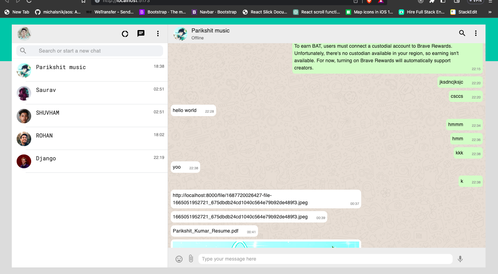

# WHATSAPP_CLONE

# WhatsApp Clone

This project is a simple clone of the popular messaging application WhatsApp. It is built using modern web technologies to replicate the core functionality and user experience of the original WhatsApp.

## Features

- User  authentication with google.
- Real-time messaging between users.
- Sending and receiving multimedia files (images, documents).
- Online status indication.
- Push notifications for new messages.
- User profile management.

## Technologies Used

The following technologies were used to develop this WhatsApp clone:

- **Front-end**: HTML, CSS, JavaScript, React.js.
- **Back-end**: Node.js, Express.js.
- **Database**: MongoDB.
- **Real-time communication**: Socket.io.
- **Encryption**: OpenPGP.js.

## Getting Started

To run this project locally, follow these steps:

1. Clone the repository: `git clone https://github.com/Scarecrow17081999/WHATSAPP_CLONE`
3. Install the dependencies: `npm install`
4. Set up a MongoDB database and update the connection string in the server configuration.
7. Start the server: `npm run dev`
8. Start the client: `npm run dev`

Now you can access the WhatsApp clone by visiting `http://localhost:${PORT}` in your web browser.

## Contributing

Contributions to this project are welcome. If you find any issues or want to add new features, please submit a pull request. Make sure to follow the existing coding style and conventions.

## License

This project is licensed under the [MIT License](LICENSE). Feel free to use and modify the code for your own purposes.

